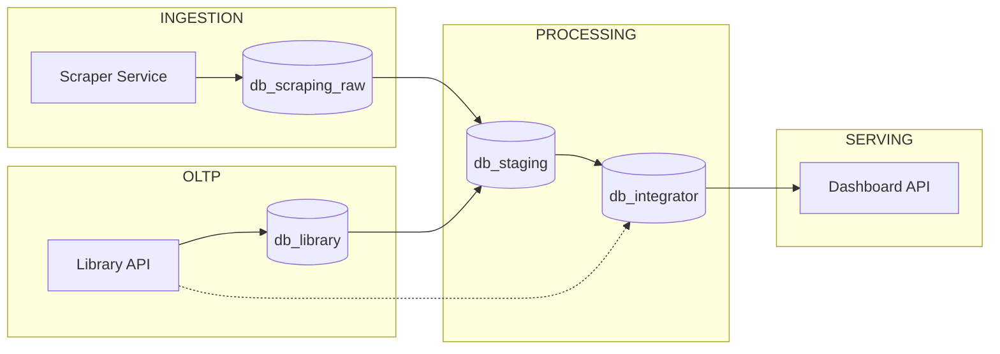

# TDD — Technical Design Document (Production-Grade Data Platform: Books Ecosystem)

## 1. Document Purpose
Dokumen ini merupakan turunan dari PRD dan berfungsi sebagai referensi teknis implementasi sistem data engineering secara production-grade.

Audience:
- Data Engineer
- Backend Engineer
- DevOps

---

## 2. System Architecture (Detailed)



### Flow Description
1. **Scraping DAG** (every 30 min): Fetches data from books.toscrape.com, validates, deduplicates, and loads to `db_scraping_raw`
2. **Frontend + Library API**: Users manually add books via UI → stored in `db_library`
3. **Staging DAG** (every 1 hour): Extracts from BOTH `db_scraping_raw` AND `db_library`, merges, validates, deduplicates by hash(title+price), loads to `db_staging` → `db_integrator`
4. **Mart DAG** (daily): Extracts from `db_staging`, upserts `dim_book` and inserts `fact_books` in `db_integrator`
5. **Library API**: Dual connection — CRUD operations on `db_library`, Dashboard queries from `db_integrator`

---

## 3. Service-Level Design

### 3.1 Library API
- Framework: FastAPI
- Pattern: Clean Architecture
- Dual DB Connection:
  - `db_library`: CRUD operations (POST/GET /books)
  - `db_integrator`: Dashboard queries (GET /dashboard)

#### Endpoint
| Method | Endpoint | Description |
|-------|---------|------------|
| POST | /books | Create book |
| GET | /books | List books |

#### Validation
- title: required
- price: > 0
- rating: 1–5

---

### 3.2 Scraper Service
- Runtime: Python
- Library: requests, BeautifulSoup

#### Logic
- Fetch halaman listing (books.toscrape.com/catalogue/page-1.html)
- Parse `.product_pod` untuk title, price, rating, availability
- Fetch halaman detail untuk setiap buku
- Extract category dari breadcrumb (`ul.breadcrumb > a:last-child`)
- Limit 10 item per run

#### Idempotency
- hash(title + price)

#### Category Extraction
- URL detail: `http://books.toscrape.com/catalogue/{href}`
- Breadcrumb pattern: `Home / Books / {Category} / {Title}`
- Category = last `<a>` tag in `ul.breadcrumb`

---

## 4. Database Design (DDL Level)

### 4.1 RAW

```sql
CREATE TABLE scraped_books_raw (
    id NUMBER GENERATED BY DEFAULT AS IDENTITY PRIMARY KEY,
    title VARCHAR2(255),
    price NUMBER,
    rating NUMBER,
    availability VARCHAR2(100),
    category VARCHAR2(100),
    scraped_at DATE DEFAULT SYSDATE
);
```

---

### 4.2 STAGING

```sql
CREATE TABLE stg_books (
    sk VARCHAR2(64) PRIMARY KEY,
    title VARCHAR2(255),
    category VARCHAR2(100),
    price NUMBER,
    rating NUMBER,
    source VARCHAR2(50),
    processed_at DATE
);
```

---

### 4.3 MART

```sql
CREATE TABLE dim_book (
    sk VARCHAR2(64) PRIMARY KEY,
    title VARCHAR2(255)
);

CREATE TABLE fact_books (
    id NUMBER GENERATED BY DEFAULT AS IDENTITY PRIMARY KEY,
    book_sk VARCHAR2(64),
    category VARCHAR2(100),
    price NUMBER,
    rating NUMBER,
    source VARCHAR2(50),
    created_at DATE
);
```

---

## 5. ETL Pipeline Design

### 5.1 Job Breakdown

#### DAG: scraping_dag
- task_fetch
- task_parse
- task_validate_schema
- task_load_raw

#### Schedule
- Every 30 minutes

#### DAG: staging_dag
- task_extract_raw (from db_scraping_raw + db_library)
- task_merge_sources
- task_clean
- task_deduplicate
- task_load_stg
- task_load_integrator

#### Schedule
- Every 1 hour

#### DAG: mart_dag
- task_extract_stg
- task_upsert_dim
- task_insert_fact

---

### 5.2 Incremental Logic

```sql
WHERE updated_at > :last_watermark
```

---

### 5.3 Watermark Table

```sql
CREATE TABLE etl_watermark (
    job_name VARCHAR2(100) PRIMARY KEY,
    last_run DATE
);
```

---

## 6. Data Validation Layer

### Rules Enforcement
- Implement di staging

### Example
```python
if price <= 0:
    reject()
```

---

## 7. Error Handling

### Strategy
- Retry: 3x
- Log error
- Insert ke DLQ

### DLQ Table

```sql
CREATE TABLE dlq_books (
    id NUMBER,
    payload CLOB,
    error_message VARCHAR2(500),
    created_at DATE
);
```

---

## 8. Airflow Design

### Best Practices
- 1 task = 1 responsibility
- No heavy logic di DAG

### Dependency
- scraping → staging → mart

---

## 9. Deployment

### Environment
- dev
- staging
- prod

### Tools
- Docker
- CI/CD pipeline

---

## 10. Testing Strategy

### Unit Test
- transform function

### Integration Test
- ETL pipeline end-to-end

### Data Test
- quality rules

---

## 11. Security

- DB credentials via env
- Role-based access

---

## 12. Observability

### Logging
- JSON structured log

### Metrics
- records processed
- error count

---

## 13. Performance Optimization

- Index pada sk
- Partition pada created_at

---

## 14. Open Issues

- Belum ada lineage tracking
- Belum ada schema registry

---

## 15. API Contract (OpenAPI-Level)

### Base URL
- `/api/v1`

### POST /books
Request:
```json
{
  "title": "string",
  "category": "string",
  "price": 10.5,
  "rating": 4
}
```

Response (201):
```json
{
  "id": 123,
  "status": "created"
}
```

Error (400):
```json
{
  "error": "VALIDATION_ERROR",
  "message": "price must be > 0"
}
```

### GET /books
Response (200):
```json
[
  {
    "id": 1,
    "title": "...",
    "category": "...",
    "price": 10.5,
    "rating": 4
  }
]
```

### PUT /books/{id}
Request:
```json
{
  "title": "Updated Title",
  "category": "Fiction",
  "price": 12.5,
  "rating": 5
}
```

Response (200):
```json
{
  "id": 1,
  "status": "updated"
}
```

### DELETE /books/{id}
Response (200):
```json
{
  "id": 1,
  "status": "deleted"
}
```

### GET /books/scraped
Response (200):
```json
[
  {
    "id": 1,
    "title": "...",
    "category": "Poetry",
    "price": 51.77,
    "rating": 3,
    "availability": "In stock",
    "scraped_at": "2026-05-01 19:30:00"
  }
]
```

### GET /books/integrator
Response (200):
```json
[
  {
    "sk": "abc123...",
    "title": "...",
    "category": "Poetry",
    "price": 51.77,
    "rating": 3,
    "source": "scraper",
    "created_at": "2026-05-01 19:32:00"
  }
]
```

### GET /dashboard
Response (200):
```json
{
  "total_books": 16,
  "total_categories": 12,
  "avg_price": 35.11,
  "rating_distribution": [{"rating": 1, "count": 6}, ...],
  "category_stats": [{"category": "Fiction", "count": 2, "avg_price": 37.55}, ...],
  "recent_books": [...]
}
```

---

## 16. Airflow DAG Blueprint (Task-Level)

### scraping_dag
- fetch_html
- parse_books
- validate_schema
- load_raw

Schedule: `*/30 * * * *` (every 30 minutes)

Dependencies:
```
fetch_html >> parse_books >> validate_schema >> load_raw
```

Retry Policy:
- retries: 3
- delay: 5m

---

### staging_dag
- extract_raw (fetches from db_scraping_raw + db_library)
- merge_sources
- validate_data
- deduplicate
- load_staging

Schedule: `0 * * * *` (every 1 hour)

---

### mart_dag
- extract_staging
- upsert_dim_book
- upsert_dim_category
- insert_fact

---

## 17. Data Lineage Design

### Column Lineage Example

| Target | Source | Transformation |
|-------|--------|---------------|
| fact_books.book_sk | stg_books.sk | direct |
| fact_books.price | stg_books.price | cleaned |
| fact_books.rating | stg_books.rating | validated |

### Audit Columns
- source_system
- ingestion_time
- pipeline_run_id

---

## 18. Migration & Versioning Strategy

### Tool
- Flyway (recommended)

### Rules
- Versioned SQL files (V1__init.sql, V2__add_index.sql)
- No direct DB change

### Rollback
- Manual rollback script per migration

---

## 19. Performance & Scaling Blueprint

### Partitioning
- fact_books partition by range(created_at)

### Indexing
- index on book_sk
- index on created_at

### Query Pattern Optimization
- gunakan materialized view untuk dashboard

---

## 20. Data Lineage & Metadata (Advanced)

Future Integration:
- OpenMetadata / Amundsen

---

## 21. Testing Blueprint

### Unit Test
- transform logic

### Integration Test
- DAG end-to-end

### Data Test
- row count consistency
- null check

---

## 22. SLA per DAG

| DAG | Schedule | SLA |
|-----|----------|-----|
| scraping | Every 30 min | 30 min |
| staging | Every 1 hour | 45 min |
| mart | Daily | 60 min |

---

## 23. Frontend Design (Library App)

### Purpose
UI untuk mengelola buku dan menampilkan data dari seluruh ekosistem (library, scraping, integrator, dashboard)

### Tech Stack
- React + TypeScript
- Axios (API client)
- Nginx (static file server)

### Navigation Menu
| Menu | Description | API Endpoint |
|------|-------------|--------------|
| Book List | CRUD books with edit/delete actions | GET/POST/PUT/DELETE /api/v1/books |
| Book Scrap | Shows scraped books with categories | GET /api/v1/books/scraped |
| Book All | Shows merged books from integrator | GET /api/v1/books/integrator |
| Dashboard | KPIs, rating distribution, category stats | GET /api/v1/dashboard |

### Features
- **Book List**: Table with filter by category/rating, pagination, edit modal, delete confirmation
- **Book Scrap**: Read-only table showing scraped books with category, price, rating, availability
- **Book All**: Read-only table showing integrator books with source (scraper/library)
- **Dashboard**: KPI cards, horizontal bar charts for rating and categories, recent books table

### API Integration
- POST /api/v1/books
- GET /api/v1/books
- PUT /api/v1/books/{id}
- DELETE /api/v1/books/{id}
- GET /api/v1/books/scraped
- GET /api/v1/books/integrator
- GET /api/v1/dashboard

### UI Flow
1. User buka halaman Book List
2. Data loading → tampil skeleton
3. Data muncul dengan pagination dan filter
4. User bisa create/edit/delete buku
5. User bisa switch ke Book Scrap, Book All, atau Dashboard

### Non-Functional
- Latency < 2 detik
- Error handling user-friendly
- Responsive design

---

## 24. Production Readiness Checklist

### Infrastructure
- [ ] Semua service dockerized
- [ ] Environment separation (dev/staging/prod)
- [ ] Secrets via env/secret manager

### Data
- [ ] Data contract enforced (runtime)
- [ ] Idempotent pipeline
- [ ] Backfill tested

### Pipeline
- [ ] DAG retry & alert configured
- [ ] SLA per DAG defined
- [ ] Concurrency control set

### Database
- [ ] Index & partition applied
- [ ] Migration via Flyway
- [ ] Backup strategy tersedia

### API
- [ ] OpenAPI documented
- [ ] Versioning (/v1)
- [ ] Rate limiting (optional)

### Observability
- [ ] Logging terstruktur
- [ ] Monitoring aktif
- [ ] Alerting (failure, SLA breach)

---

## 25. Runbook (Operational Playbook)

### 25.1 Pipeline Failure

#### Scenario
DAG gagal (scraping/staging/mart)

#### Action
1. Cek Airflow UI
2. Identifikasi task gagal
3. Lihat log error
4. Retry manual jika perlu
5. Jika data corrupt → rollback staging

---

### 25.2 Data Quality Issue

#### Scenario
Data tidak valid / anomali

#### Action
1. Query DLQ table
2. Analisis error
3. Perbaiki rule / source
4. Re-run pipeline

---

### 25.3 Backfill Data

#### Scenario
Perlu load ulang data historis

#### Action
1. Set range tanggal
2. Jalankan DAG manual
3. Pastikan idempotent

---

### 25.4 Database Issue

#### Scenario
Query lambat

#### Action
1. Check execution plan
2. Tambah index / partition

---

### 25.5 Scraper Failure

#### Scenario
Website berubah

#### Action
1. Update parser (HTML selector)
2. Test lokal
3. Deploy ulang

---

### 25.6 Incident Ownership

| Issue | Owner |
|------|------|
| Pipeline | Data Engineer |
| API | Backend Engineer |
| Infra | DevOps |

---

## 26. Enhancements for Production Maturity

### 26.1 Automated Runbook (Reducing Manual Intervention)

#### Improvements
- Auto-retry dengan exponential backoff
- Alert otomatis ke Slack/Email jika DAG gagal
- Circuit breaker: disable DAG jika gagal berulang (>5x)

#### Tools
- Airflow Alerting (EmailOperator / Slack webhook)
- Prometheus + Alertmanager (optional)

---

### 26.2 Frontend Production UX Enhancements

#### Improvements
- Pagination untuk list buku
- Search & filter (by category, rating)
- Loading state (spinner/skeleton)
- Error state (user-friendly message)

#### Example UX Flow
1. User buka halaman list
2. Data loading → tampil skeleton
3. Data muncul dengan pagination
4. User bisa filter/search

---

## 27. Change Management Strategy

### 27.1 Schema Change

#### Scenario
Perubahan struktur tabel

#### Strategy
- Gunakan versioned migration (Flyway)
- Backward compatible sebisa mungkin
- Deprecation period sebelum removal

---

### 27.2 Source Change (Scraping)

#### Scenario
HTML berubah

#### Strategy
- Monitoring failure rate scraper
- Alert jika parsing error naik
- Version parser

---

### 27.3 Data Volume Growth

#### Scenario
Data meningkat 10x

#### Strategy
- Partitioning lebih granular
- Query optimization
- Horizontal scaling (Airflow workers)

---

### 27.4 Pipeline Evolution

#### Scenario
Penambahan transformasi baru

#### Strategy
- Tambah DAG baru (tidak modify existing langsung)
- Canary deployment
- Validasi output sebelum switch

---

### 27.5 Ownership & Governance

- Data Engineer: pipeline & data
- Backend: API
- DevOps: infra

---

## 28. Final Conclusion

Sistem ini sekarang mencakup:
- End-to-end (frontend → API → data platform → dashboard)
- Production readiness checklist
- Runbook operasional

Artinya:
Sistem tidak hanya bisa dibangun, tetapi juga bisa dioperasikan dan dipelihara oleh tim secara berkelanjutan.
